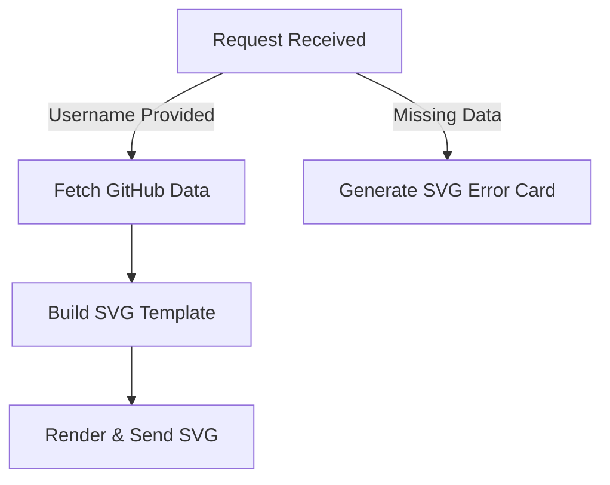

# GitHub Profile Card Generator API

This project provides a dynamic API for generating customized GitHub profile cards in **SVG** format. 
It fetches real GitHub user data using the GitHub API and renders it into a visually appealing card 
with animations, statistics, personal info, and fallback messaging for errors.

---

## ✨ Features

- Fetches **real-time GitHub profile data** (avatar, bio, stars, repositories, etc.)
- Dynamic **SVG card rendering** with animation and styling
- Automatic text wrapping for long descriptions
- Multiple card layouts using parameters
- Fallback SVG **error card** for invalid/missing data
- Supports extended info such as:
  - Description
  - Age
  - Study / Education
  - Religion
  - Job
  - Phone Number
  - Email
  - Hobby

---

## 📌 Available API Endpoints

### 1️⃣ /api/svg-card?type=1
Generate SVG card containing GitHub + Description + personal information.

**Example usage:**
```
/api/svg-card?type=1&name=octocat&age=18&study=IT&religion=None&job=Developer&number=08123&email=octo@gmail.com&hobby=Coding
```

| Parameter | Required | Description |
|----------|----------|-------------|
| name | ✅ | GitHub username (fetches avatar + stats) |
| desc | ❌ | Custom bio |
| age, study, religion, job, number, email, hobby | ❌ | Personal details |

---

### 2️⃣ /api/svg-card?type=2
Generate SVG card containing GitHub + Description.

**Example usage:**
```
/api/svg-card?type=2&name=lemonsync&desc=About%20You%20And%20Me
```

| Parameter | Required | Description |
|----------|----------|-------------|
| name | ✅ | GitHub username (fetches avatar + stats) |
| desc | ❌ | Custom bio |

---
---

## 🧠 How It Works



---

## 🛠️ Tech Stack

| Technology | Purpose |
|-----------|---------|
| **Node.js + Express** | API Server |
| **Node-Fetch** | GitHub API data fetching |
| **Custom SVG Renderer** | Dynamic card output |

---

## 🚀 Local Development

```bash
npm install
npm run dev
```

Server will run at:

```
http://localhost:3000
```

---

## 📦 Folder Structure

```
/api
 └─ github-card.js
/utils
 ├─ githubData.js
 ├─ theSystem.js
 └─ allFunction.js
```

---

## ❤️ Credits

Built by *LemonSync* — about me and you, powerful visualization.

Feel free to contribute improvements, additional card styles, and layout themes! 🚀
